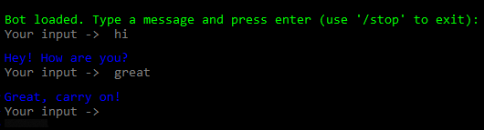
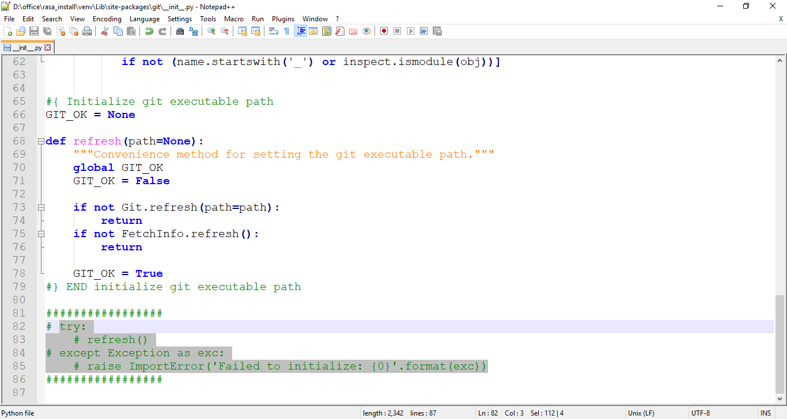
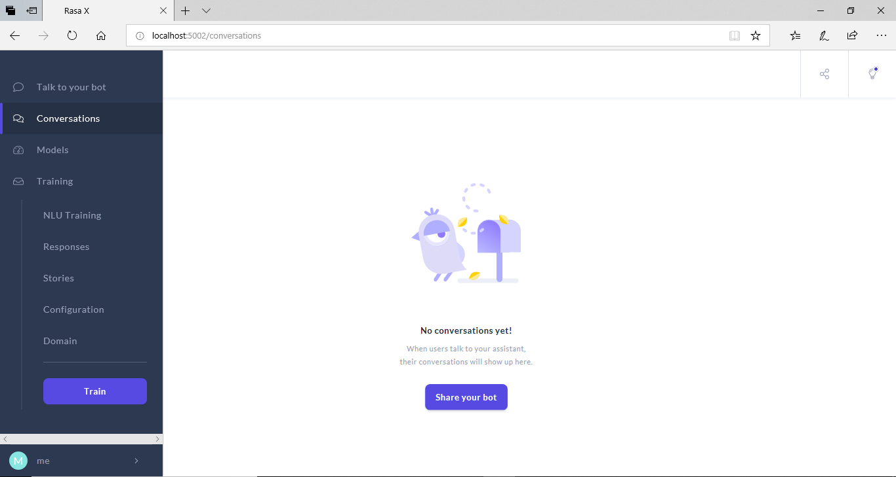

# Rasa and chatbots

 

Rasa is an open source maching learning platform for building contextual AI assistants and chatbots in text and voice. It is one of most popular framework for building chatbots. Let's start with installing Rasa, here I'm sharing the problems I faced while installing Rasa.


## Install Rasa

We can start with having a look at Rasa docs for installation. On the links below you will find installation process for different OS, but I will only discuss about windows
+ [Install Rasa](https://rasa.com/docs/rasa/user-guide/installation/ "Install Rasa")
+ [Install Rasa X](https://rasa.com/docs/rasa-x/0.19.5/installation-and-setup/ "Install Rasa X")

Now, some of might wonder what is Rasa X and what's the difference in Rasa and Rasa X. Well, Rasa X is actually an addition to Rasa. It doesn't change any functionality of Rasa, but adds more tools to work with.

If you already have a look at the Rasa installation doc, then you will see it **requires Python 3**. Rasa has quite a bit dependency on libraries, so do check your Python version. I will recommand to install any version from 3.7, I had Python 3.7.4 installed and it works fine.

**Microsoft visual C++ 14.0 is also prerequisite** for installing Rasa, which is not mentioned there.

Rasa doc suggested to create a virtual environment and then install Rasa. So let's start with that-

1. Create and activate virtual environment:
> + Create a directory and open the command prompt from there. In the command prompt enter the command given below to create virtual environment-
> ```
>       $ python -m venv --system-site-packages ./venv
> ```
> + Activate the virtual environment:
> ```
>       $ .\venv\Scripts\activate
> ```

2. Install Rasa and Rasa X:
> + After creating and activating the virtual environment, you can install Rasa using the below command-
> ```
>       $ pip install rasa
> ```
> + Or you can directly install Rasa X, which will automatically install Rasa. The command below will install the lastest version of Rasa and Rasa X-
> ```
>       $ pip install rasa-x --extra-index-url https://pypi.rasa.com/simple
> ```
> *Note: You will probably have to downgrade the sanic/sanic-jwt version to 19.9/1.3.2 correspondingly (if any other version is installed than this), as Rasa doesn't support any of other version than this.*
> + You can also install a specific version of rasa by the following command (enter the version in the place of version)-
> ```
>       $ pip install rasa-x==version --extra-index-url https://pypi.rasa.com/simple
> ```
> *Note: As Rasa has quite a bit of dependencies, so while installing any of previous versions you have to check the compatibality of the libraries*


## Build Chatbot

#### Let's start with creating a project:

After installing Rasa successfully, let's start building chatbot. And while building the bot we will discuss about different components and the functionalities of the components.

+ To create an initial project enter the below command in the command prompt, make sure the virtual environment is activated
```
        $ rasa init
```
+ You will have to confirm the directory path to complete the action, just press enter for that.
+ You will also be asked if you want to train the project. If you press Y then the project will start training, and if you press N the project will not get trained.
+ In case you train the project while it was creating, you will be asked if you want to chat with the bot in the command prompt. You can either choose to or not to chat with the bot in the command prompt.

#### Let's train our project:

Let's assume you didn't train the project earlier. No worries, you can simply train the project using the below command-
```
        $ rasa train
```
After training, a model will be saved automatically in the project directory.

#### Let's chat with our bot:

To run the project, which means chatting with the bot, you can simply run the below code in command prompt-
```
        $ rasa shell
```
This will let you chat with the bot in the command prompt.

 

You can also chat with the bot using rasa-x, just enter the command given below-
```
        $ rasa x
```
This will open up a webpage where you will be able to chat, train and also be able to use many other tools.

*Note: Some of you might get an error after running the command, which is- "ImportError: Bad git executable." To solve this follow the instructions given below-*
 
>Here you can see the error marked in red box, now let's solve this-
>+ First copy the path similar to the yellow marked box, you have to copy the path till ..\venv\Lib\site-packages\git
>+ Goto the copied path, and open the file named *--init--.py*. You can use any editor of your choice.
>+ At the end of the code you will find a try-exception function, just comment out the function. Save the file. Run the command again and you are good to go. 
 

After running the command, you might have to agree with their some policies. Then a browser will open up, where you can chat the with bot and also use other tools.
 

##### Congratulation on installing Rasa

Here you can find some Rasa projects, have a look and best of luck.
+ [Rasa Templates](https://github.com/cedextech/rasa-chatbot-templates "Rasa Templates")
+ [Rasa Documentations](https://rasa.com/docs/ "Rasa Docs")
