# SAGA Pattern| Implementing Distributed Transaction Using Microservices| Part-2
In this article, we will show the implementation structure of previously explained business logic ([see here](README.pdf)). 
For this purpose, we will try to cover the following,
* giving snapshot of project structure 
* giving snapshot of database tables
* giving snapshot of Rabbitmq queues
* code link of full project

## Required technology
* Spring Boot, for building microservices
* MySQL, for handling database
* RabbitMQ, for acting as message broker
* Postman, for initiating transaction in User Request service
* Eclipse or similar IDE that supports these technologies

## Project Structure
Here I am showing snapshots of structures of the microservices. Project structure has been made following layerd architecture. 

#### Project Structure for Bank Service

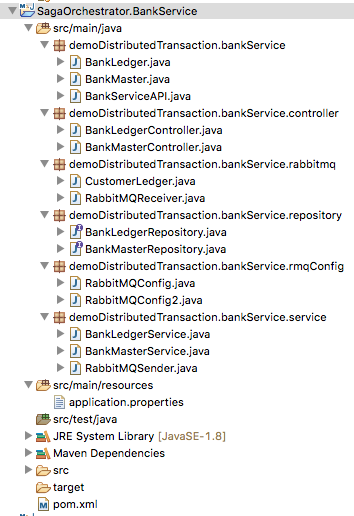

#### Project Structure for Client Service

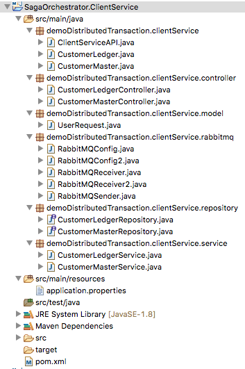

#### Project Structure for Orchestrator

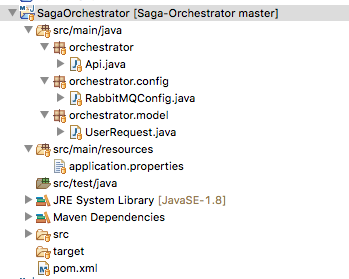

#### Project Structure for User Request

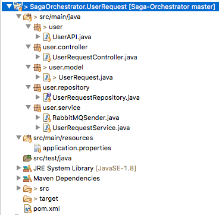

## Database Structure
Four distinct databases have been used for four microservices. MySql has been used for handling databases.
#### Database Tables
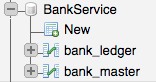 
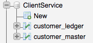
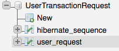

#### User Request table
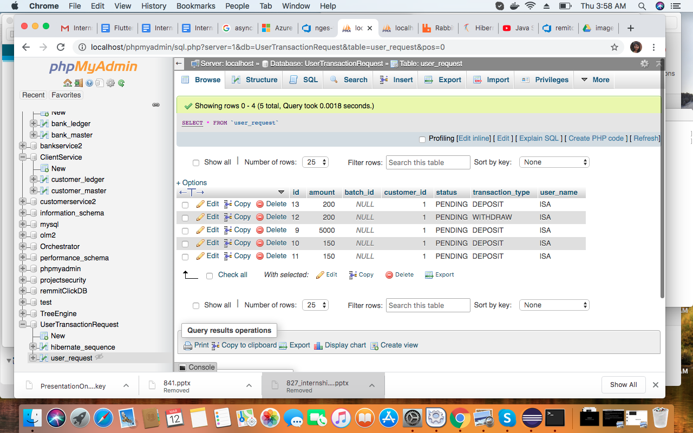

#### Client Ledger table
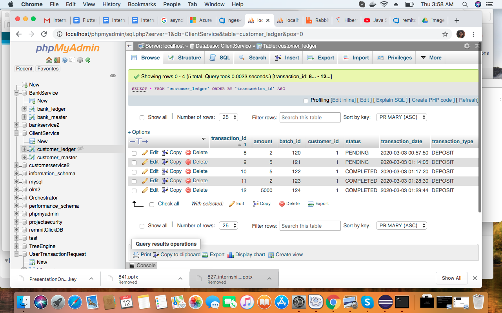

#### Client Master table

#### Bank Ledger table
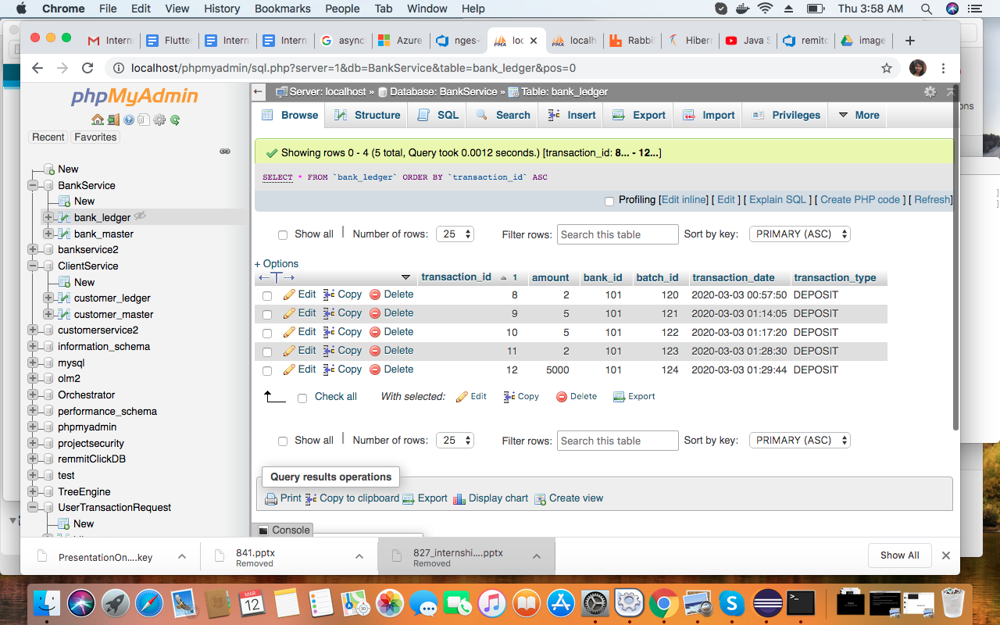

#### Bank Master table
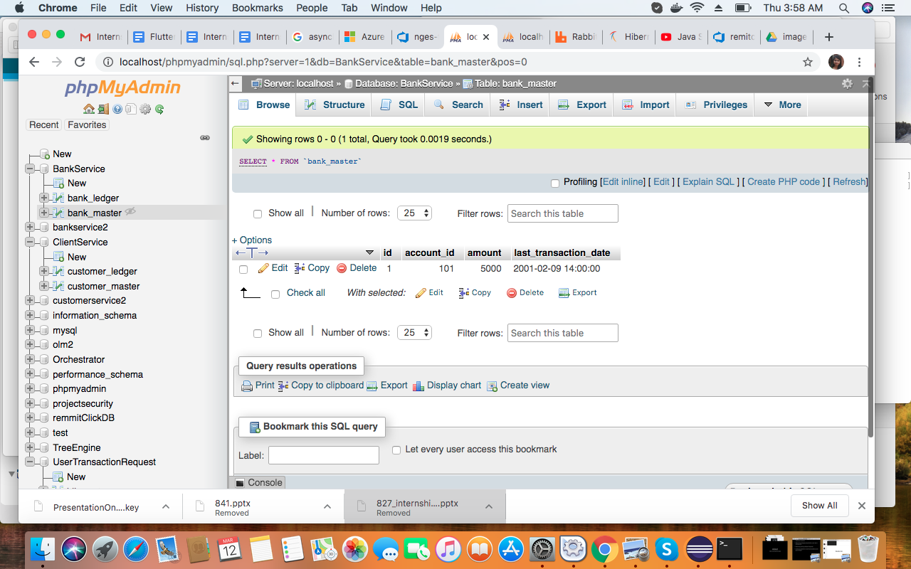

## RabbitMQ Queues
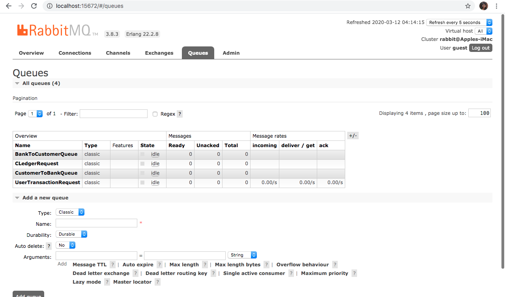

## Postman 
Hitting endpoint of User Request through a post request and initiating transaction.
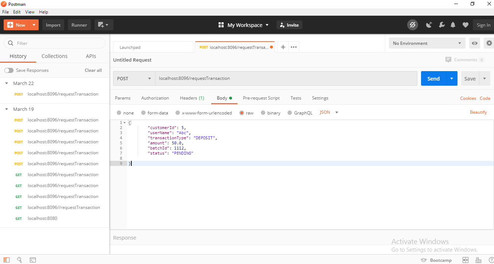