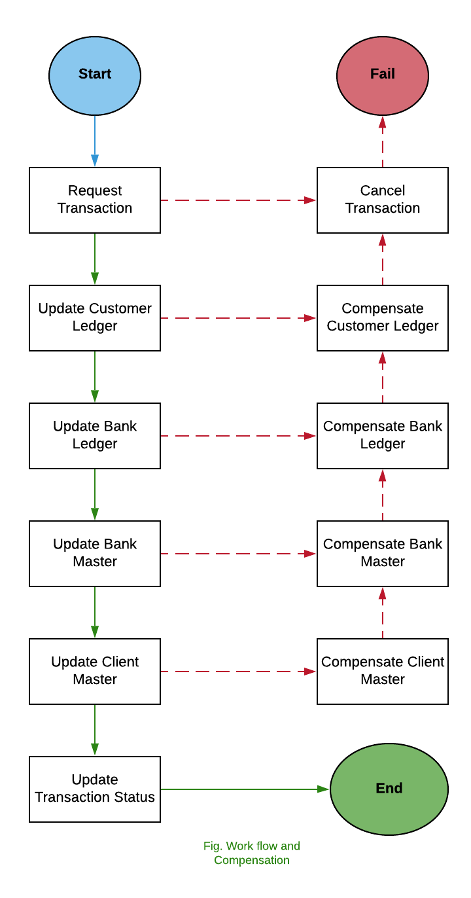
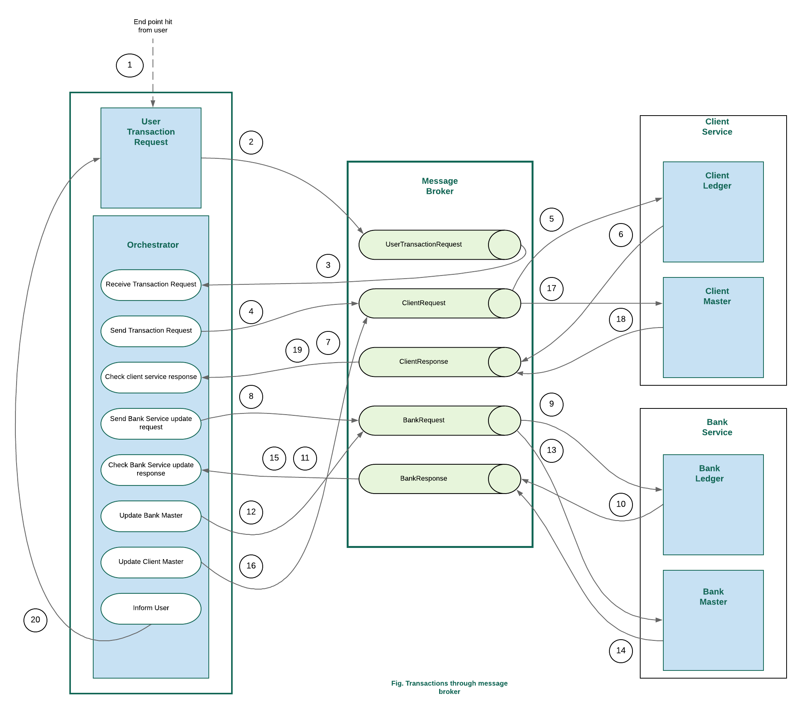
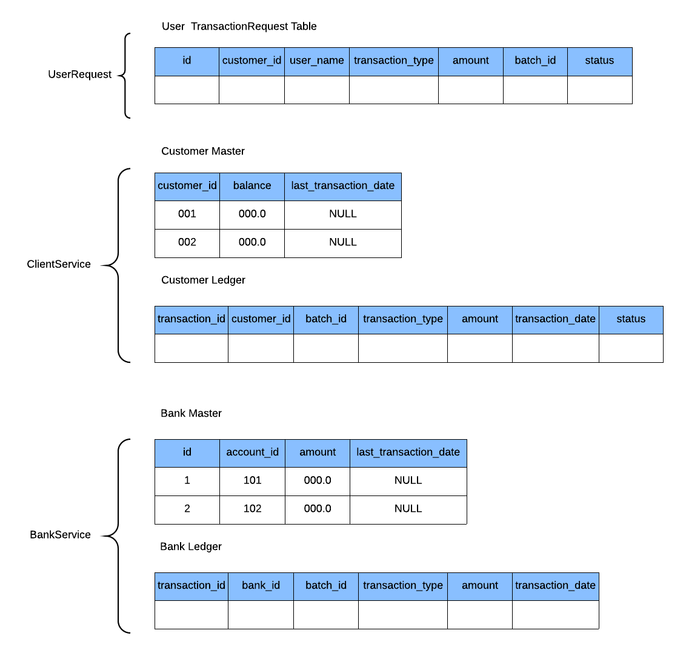
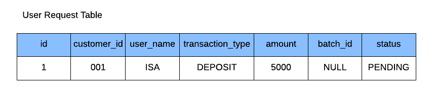
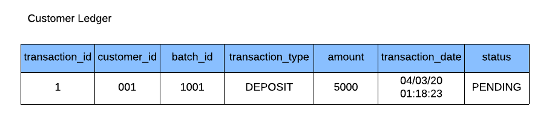
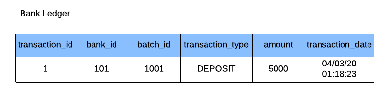
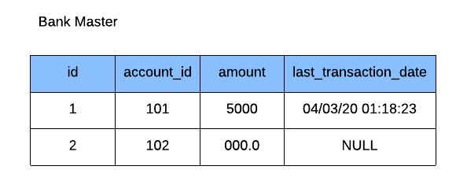
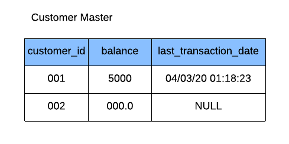
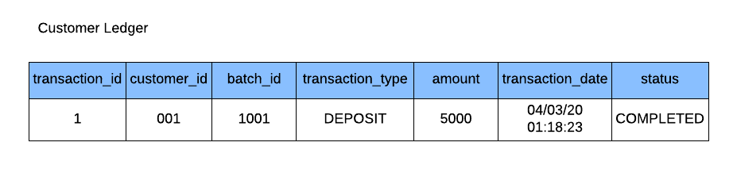
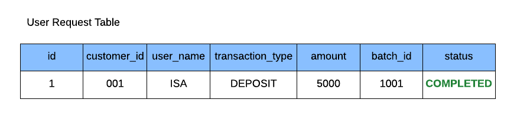

# SAGA Pattern| Implementing Distributed Transaction Using Microservices
In this article, we will show how to implement `Distributed Transaction` among microservices using `Saga Pattern`. For this purpose, we will try to cover the following,
* giving a basic concept of Distributed Transaction and Saga Pattern
* understanding sample business for a banking system 
* implementing a sample microservice based banking system using Spring boot
* implementing distributed transaction across multiple microservices using Saga Pattern
## Distributed Transaction
In a nutshell, Distributed Transaction is the transaction that span over multiple physical systems over the network. In microservice based system, handling transactions has been one of the biggest challenges. In a monolithic system, the whole service is built as a single unified unit with a single database. Unlike the monolithic system, a microservice architecture decomposes the whole system into multiple self-encapsulated services each of them having own database. As a result, a local transaction in the monolithic system becomes distributed into multiple services that are called in a sequence. 

### What is the problem?
In a monolith system, there is a single database that can maintain the `ACID property`(Atomicity, Consistency, Isolation and Durability). But in a microservice based architecture, as a single transaction can span over multiple databases, it becomes challenging to maintain the ACID property of databases.

### What is the solution?
1. `Two phase commit (2PC)` : 2PC handles every transaction in two phases, *Prepare Phase* & *Commit Phase*. *Transaction Coordinator* maintains the life cycle of transaction.
*Prepare Phase*: In this phase, the controlling node would ask all the participating nodes if they are ready to commit. The participating nodes would then respond in yes or no.
*Commit Phase*: Then, if all the nodes had replied in affirmative, the controlling node would ask them to commit, else even if one node replied in negative, it’ll ask them to roll back.
To understand 2PC architecture in detail you can [see here](https://medium.com/swlh/handling-transactions-in-the-microservice-world-c77b275813e0)
2. `SAGA Pattern` : A saga is a sequence of local transactions where each transaction updates data within a single service. The first transaction is initiated by an external request corresponding to the system operation, and then each subsequent step is triggered by the completion of the previous one.
SAGA is one of the best way to ensure the consistency of the data in a distributed architecture without having a single ACID transaction. SAGA commits multiple compensatory transactions at different stages ensuring to rollback when required.
Saga transaction can be implemented in different ways, but the two most popular ways are:

   * _Events/Choreography_: When there is no central coordination, each service produces and listen to other service’s events and decides if an action should be taken or not. 
   In the Events/Choreography approach, the first service executes a transaction and then publishes an event. This event is listened by one or more services which execute local transactions and publish (or not) new events.The distributed transaction ends when the last service executes its local transaction and does not publish any events or the event published is not heard by any of the saga’s participants.
   [Undersatnd Saga Choreography in detail from here](https://blog.couchbase.com/saga-pattern-implement-business-transactions-using-microservices-part/)
   * _Command/Orchestration_: When a coordinator service is responsible for centralizing the saga’s decision making and sequencing business logic.
   In the orchestration approach, we define a new service with the sole responsibility of telling each participant what to do and when. The saga orchestrator communicates with each service in a command/reply style telling them what operation should be performed.
   [Undersatnd Saga Orchestration in detail from here](https://blog.couchbase.com/saga-pattern-implement-business-transactions-using-microservices-part-2/)
   
## Implementing sample microservice based Banking System
We will now implement a sample microservice based banking system that provides deposit and withdraw services.
### Required technology
* Spring Boot, for building microservices
* MySQL, for handling database
* RabbitMQ, for acting as message broker
### Understanding the business logic
Our business contains three microservices, *User Request Service*, *Client Service* and *Bank Service*. There is also a *Message Broker* for passing messages across the microservices.

* User request service: consists of User Transaction Request and Orchestrator. Orchestrator here control the flow of Saga Orchestration. 
Code for User Transaction Request : [User Transaction Request](https://github.com/IshitaApan/Saga-Pattern/tree/master/UserRequest) 
Code for Orchestrator : [Orchestrator](https://github.com/IshitaApan/Saga-Pattern/tree/master/Orchestrator) 
* Client Service: consists of Customer Ledger and Customer Master. 
Code for Client Service : [Client Service](https://github.com/IshitaApan/Saga-Pattern/tree/master/ClientService)
* Bank Service: consists of Bank Ledger and Bank Master. 
Code for Bank Service : [Bank Service](https://github.com/IshitaApan/Saga-Pattern/tree/master/BankService)
* Message Broker: contains five queues for storing and forwarding messages across microservices. The queues are- *UserTransactionRequest, ClientRequest, ClientResponse, BankRequest and BankResponse*.
#### Workflow and Compensation:
Understand SAGA workflow and compensation for this business at a glance,

#### Transactions:
Distributed transactions across the microservices through message broker,

1. Any user will request for a transaction hitting the end point
2. The user request will be sent to the message broker. The request file will be stored in UserTransactionRequestQueue.
3. Orchestrator will be forwarded the user request message.
4. Orchestrator will then send the message to broker and the message will be stored in ClientRequest queue.
5. The message will be forwarded to client service. Client Ledger now check the eligibility of the request. 
6. According to the eligibility of the request, client service will send the response message to ClientResponse queue.
7. Client response will be forwarded to orchestrator.
8. If response is affirmative, orchestrator will send a bank ledger request and the request will be stored in BankRequest queue.
9. Message broker will then forward the request to bank service.
10. After analysing whether the bank ledger request is legitimate, the bank service will send a response message to BankResponse queue.
11. The response will be sent to orchestrator.
12. If the response message is affirmative, orchestrator will send a request to BankRequest queue for updating Bank master.
13. The request will be forwarded to Bank Service.
14. After updating Bank Master, the bank service will send a response message to BankResponse queue.
15. The response message will be forwarded to Orchestrator.
16. If the response is affirmative, orchestrator will send a request to ClientRequest queue for updating Client Master.
17. The request will be forwarded to Client Service.
18. After updating Client Master, Client Service will send the response message to Client Response queue.
19. The response will be sent to Orchestrator.
20. If the response is affirmative, Orchestrator inform User that the transaction status is *successful*   If any of the responses is negative, the corresponding compensation will be held and user will be informed the transaction status is *aborted*.

#### Data Flow through the Databases of Microservices

* The initial condition of the databases:  
  
* After step 1 being successful,  
  
* After step 5 being successful,  
  
* After step 9 being successful,  
  
* After step 13 being successful,  
  
* After step 17 being successful,  
  
  
* After step 20 being successful,  
  
#### [Full Project Link](https://github.com/IshitaApan/Saga-Pattern)

